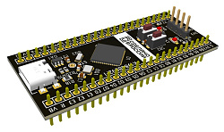

# K1986BE92FI_Example
Пример проекта для K1986BE92FI (MDR1211FI)

Проект компилируется и подает признаки жизни на отладочной плате (светодиод и CLI).

На данный момент стоит рассматривать только как справочную информацию, проверялась только корректность сборки через Github Actions, корректность работы самого ПО полноценно не тестировалась. Также в библиотеках CMSIS/SPL есть ряд мест, реализация которых зависит от компилятора и добавлена тестово.

# Благодарности

Отдел технической поддержки АО «ПКК Миландр» - за оперативные ответы и участие в создании примера.
